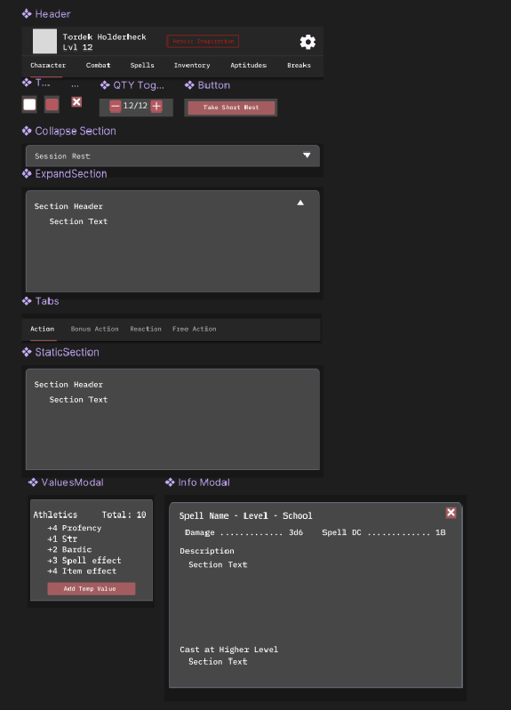

# Leyfarers wireframes — Phase D entry gate

Wireframes for the TLC character sheet, one page per tab, derived from the design
doc's own embedded mockups (not generic AI patterns — the risk design finding 7
flagged, plan L818-821). Each page pairs the doc mockup with the plan's ordered
per-tab hierarchy (plan L277-285), the interaction state-matrix rows that apply
(plan L289-303), and a map from the design-doc component vocabulary to the real
`CharKeeperApp` components already in the repo.

**Entry gate (plan L269-271, L821):** No Phase D component ships without its
wireframe. Every Phase D PR MUST link the wireframe page for the tab it touches.
Ticket #26 exists so that gate is enforceable — this index is the checklist.

## Source of truth

- Mockups: `docs/reference/Leyfarers Design Document - v2.md` L1291-1307, 9
  base64-embedded PNGs.
- Extraction: [`extract-mockups.mjs`](extract-mockups.mjs) — deterministic decode,
  byte-identical on re-run, self-checks 9 non-empty PNG-valid buffers. Run:
  `node docs/reference/leyfarers-refs/extract-mockups.mjs`.
- Plan hierarchy + state matrix: `docs/leyfarers-implementation-plan.md` L277-303.
- Component vocabulary: `docs/design-doc-digest.md` §6; real components under
  `app/javascript/applications/CharKeeperApp/components/` and
  `.../pages/Content/Character/Dnd5/`.

## Wireframe pages (link these from Phase D PRs)

| Tab | Wireframe | Mockup | Blocks build of |
|---|---|---|---|
| Combat (default) | [wireframe-combat.md](wireframe-combat.md) | image3 (+ image1 limited-use) | Combat tab, actions aggregation |
| Character | [wireframe-character.md](wireframe-character.md) | image2 | Character tab |
| Spells | [wireframe-spells.md](wireframe-spells.md) | image4 | Spells tab |
| Inventory | [wireframe-inventory.md](wireframe-inventory.md) | image5 | Inventory tab |
| Aptitudes | [wireframe-aptitudes.md](wireframe-aptitudes.md) | image6 | Aptitudes tab (TLC) |
| Breaks | [wireframe-breaks.md](wireframe-breaks.md) | image7 | Breaks/rest tab |
| Settings | [wireframe-settings.md](wireframe-settings.md) | image8 | Settings modal |

## Shared component key (image9)

The doc's own "Components" mockup renders the reusable vocabulary once. Each
wireframe maps its slots to these, so the mapping lives in one place:

| Design-doc component (image9) | Digest §6 name | Real CharKeeperApp component | Status |
|---|---|---|---|
| Header | TopBar | `molecules/PageHeader.jsx`, `molecules/CharacterNavigation.jsx` | exists |
| StatBox / StaticSection | StatBox, StaticSection | `molecules/StatsBlock.jsx` (`items[{title,value,footer}]` + children) | exists |
| T… toggle icons | ToggleIcon | `atoms/Toggle.jsx`, `atoms/Checkbox.jsx`, `atoms/IconButton.jsx` | exists |
| QTY Toggle | QTYToggle | `atoms/Input.jsx` (numeric) + `atoms/IconButton.jsx` `[−] n [+]` (see Combat health, ItemsTable) | exists |
| Button | — | `atoms/Button.jsx` | exists |
| Collapse / Expand Section | ExpandableSection | `atoms/Toggle.jsx` (title + collapsible body) | exists |
| Tabs (Action/Bonus/Reaction) | Tabs | tab routing in `Dnd5.jsx`; sub-tabs are new local state | partial |
| ValuesModal (calc breakdown) | ValueCalcModal | `createModal()` + custom body (see `Dnd5/Combat.jsx` modal) | exists (compose) |
| Info Modal (spell/item desc) | InfoModal | `molecules/Modal.jsx` / `createModal()` | exists |
| Item row | ItemRow | `molecules/ItemsTableItem.jsx`, `molecules/ItemsTable.jsx` | exists |
| EditableField (inline override) | EditableField | `molecules/EditWrapper.jsx` + `atoms/Input.jsx`, override via `character_bonus` | exists |
| Levelbox (editable stat) | StatBox | `atoms/Levelbox.jsx` | exists |

**New for Phase D / TLC (no existing component):** rank/Focus badge, warnings-summary
banner stack (`role="alert"`, plan L316), Focus modal, dismissed-warnings restore
list (T11), attunement section (`n/3`), source-grouped Actions aggregation, spell-slot
pip boxes (touch-to-fill), Session Rest branch. These are called out per tab.

## Motion

Motion is deliberately unspecified here. The litmus "motion improves hierarchy"
was never spec'd; per `docs/TODOS.md` L52-53 ("Motion spec for tab
transitions/toggles"), tab-transition and toggle/expand motion is decided in that
deferred item, not baked into these wireframes. Each page marks its motion-bearing
surfaces (tab switch, collapse/expand, modal open, HP delta, slot fill) with a
**Motion → TODOS L52** tag so the motion pass has a punch list.

## Artifact location

Per plan L269-271 these live in the gstack designs dir
(`~/.gstack/projects/zacgoodwin-Chapterhouse/designs/leyfarers-refs/`, mirrored by
the extraction script). They are also committed here in-repo so Phase D PRs can
link a resolvable path — the entry gate (AC3) is only enforceable if the link
resolves in review.
