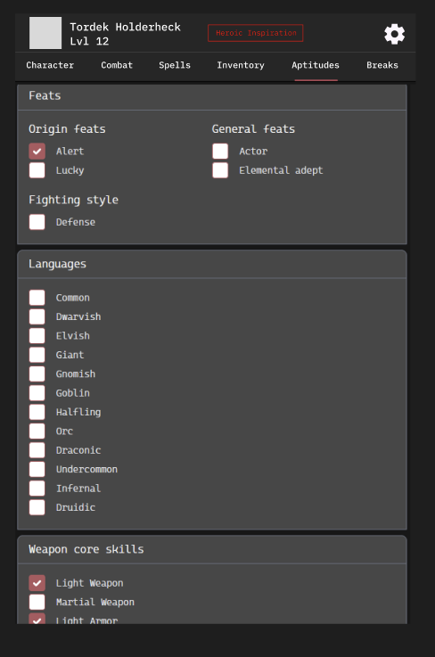

# Wireframe — Aptitudes tab (TLC umbrella)

> **Entry gate:** the Phase D PR that builds/edits the Aptitudes tab MUST link
> this file (plan L821). "Aptitudes" is a TLC term (not standard D&D) covering
> feats, languages, weapon/armor proficiencies + masteries, tools, intrinsics
> (digest §8).

## Mockup (image6)

## Ordered hierarchy (plan L283-284)

1. **Feats** — grouped **Origin / General / Fighting Style / Epic Boon /
   Val'Ruvina** (digest §8; the TLC Val'Ruvina group is the divergence from the
   base enum, digest contradiction 6). Each feat is a summary title expanding to
   its granted elements ("Tool Proficiency: Tinker's Tools; Language: Draconic").
   image6: checkbox rows under Origin/General/Fighting style.
2. **Proficiencies + Masteries** — Weapon/Armor core skills (image6 checkboxes);
   **Mastery** shows the count of weapon types with mastery, select mastery
   (over-select allowed with warning), qualifying inventory weapons auto-tagged
   and Combat weapon rows auto-update.
3. **Languages / Tools & Instruments** — language checklist (image6: Common …
   Druidic), tools/instruments list.

Then: **Intrinsics** — semi-permanent/misc TLC effects (Supernatural Gifts,
curses, "Flame Step") plus Lineage-selected traits.

## Applicable state-matrix rows (plan L290-303)

This tab is the primary home of the **Trait picker** and **Options lists** rows.

- **Trait picker (row 1):** feat/lineage selectable-trait selection — loading =
  skeleton list; empty = "0 of 3 selected" + **pool by species**; error = 422
  field errors; success = "3 of 3" + traits list; partial = "2 of 3" progress,
  a 4th pick shows an **amber over-select warning** (never blocked).
- **Options lists (row 2):** feat/language/mastery options — gated rows labeled
  `Ch.4` / `Reputation`, **not hidden**; loading = skeleton; empty = seed hint.
- **Warning banners (row 4):** mastery over-select and multiclass-prereq
  soft-warnings surface here, `role="alert"`, dismissible.

Rest confirm / Conditions do not apply.

## Component mapping

- Group sections (Feats / Languages / Weapon skills / …) → `atoms/Toggle.jsx`
  collapsible + `Checkbox.jsx` rows (matches image6).
- Feat summary → expand → `FeatureTitle.jsx` + `Toggle.jsx` body.
- Trait-picker counter ("2 of 3") → new local state; over-select amber →
  warnings banner.
- Intrinsics render via `Tlc::Feat kind: :intrinsic` serializer (plan L256-257).
- **New:** Trait-picker "n of N" surface with amber over-select warning, Mastery
  count/select control with inventory auto-tagging, Val'Ruvina feat group.
- Design guardrail (plan L318): **no card mosaics on Aptitudes** — hairline
  tables/checklists, calm surface hierarchy.

## Motion

- Feat/group collapse/expand — **Motion → TODOS L52**.
- Trait-pick add/remove + over-select warning enter — **Motion → TODOS L52**.
