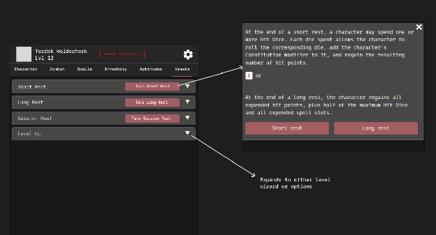

# Wireframe — Breaks tab (rest system)

> **Entry gate:** the Phase D PR that builds/edits the Breaks tab MUST link this
> file (plan L821). "Breaks" is the TLC tab name for rests (digest §8). Doc is
> inconsistent (modal vs tab, digest contradiction 1); component tree makes it a
> tab with a `LevelChange` child — this wireframe follows the tab form.

## Mockup (image7)

## Ordered hierarchy (plan L284-285)

1. **Rest-type selector** — Short Rest / Long Rest / **Session Rest** / Level Up
   rows (image7), each with a `Take …` button and a `▼` expander.
2. **Refresh confirm-summary** — expanding a rest opens a summary of exactly what
   will refresh (image7 modal: hit-die `8 d8` chip, rest description, `Short
   rest` / `Long rest` actions). Per-item toggles: Restore Rage (2/2), Recharge
   Wand (0/3), Regain 1 Exhaustion, Restore Spell Slots, Refresh custom Intrinsic.
   "Apply Rest" executes **only the checked** steps. **Session Rest** additionally
   offers to also take a long/short rest (design doc v2 L344-347, plan L287-288).
3. **Level-up entry** — the Level Up row expands to the level wizard (image7
   callout: "Expands to either level wizard or options"). Reuses the existing
   classLevels flow with TLC deltas (chapter-cap warning, trait/feat prompts);
   also reachable from the topbar level tap and the rank badge (plan L305-310).

## Applicable state-matrix rows (plan L290-303)

This tab owns the **Rest confirm** row.

- **Rest confirm (row 3):** loading = n/a (local); **empty = "nothing to
  refresh"**; error = transaction error banner (**nothing applied**); success =
  per-item checkmarks + toast, and **session rest offers long/short too**;
  partial = full resources shown with already-full items **pre-checked-disabled**.
- **Options lists (row 2):** the per-item refresh toggles behave as an options
  list (gated/unavailable items labeled, not hidden).
- **Warning banners (row 4):** chapter-cap and level-gate soft-warnings on the
  Level Up branch, `role="alert"`, dismissible.

Trait picker / Conditions do not apply.

## Component mapping

- Rest-type rows → `atoms/Toggle.jsx` (title + `Take` `Button.jsx` + expander).
- Confirm-summary → **RestSummaryModal** via `createModal()` (existing
  `Dnd5/Rest.jsx` is the base) with per-item `Checkbox.jsx`.
- Hit-die chip → `Levelbox.jsx` / labeled chip.
- Level Up branch → existing `Dnd5/ClassLevels.jsx` flow.
- **New:** Session Rest branch + "also take long/short?" prompt, per-item
  pre-checked-disabled state for already-full resources, "nothing to refresh"
  empty state.

## Motion

- Rest-row expand/collapse — **Motion → TODOS L52**.
- Confirm-summary modal open + per-item checkmark on apply — **Motion → TODOS L52**.
- Level-up wizard transition — **Motion → TODOS L52**.
