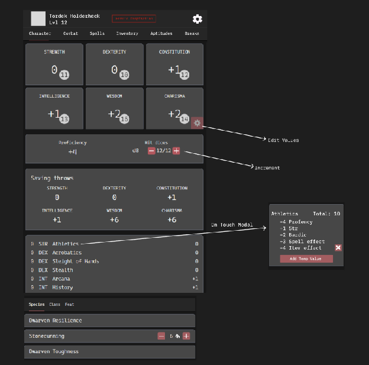

# Wireframe — Character tab

> **Entry gate:** the Phase D PR that builds/edits the Character tab MUST link
> this file (plan L821).

## Mockup (image2)

## Ordered hierarchy (plan L281-282)

1. **Ability scores** — 6 cards, modifier large with the raw score in a circle
   badge (image2). Edit via a per-card gear → **Edit Values** modal.
2. **Skills** — each row shows proficiency marker, ability, name, and score,
   plus the **advantage/disadvantage** state. Tap a skill → **ValuesModal** calc
   breakdown ("Athletics Total: 10 / +4 Proficiency / +1 Str / +2 Bardic / +3
   Spell effect / +4 Item effect", with `Add Temp Value` and a remove `x`).
   Must fold in expertise, jack-of-all-trades, and magic-item bonuses.
3. **Saving throws** — 6-up grid, editable to add modifiers.

Then: **Proficiency bonus**, **Hit dice** (`d8 12/12` with `[−][+]`), **Passive
Perception**, **Size**; **Species / Class / Feat** sub-tabs of non-combat traits
(image2: Dwarven Resilience, Stonecunning with a `[−] 6 🔥 [+]` use stepper,
Dwarven Toughness). CompanionStatBlock when a companion is attached.

## Applicable state-matrix rows (plan L290-303)

- **Warning banners (row 4):** the character overview is where the **rule-warnings
  summary** lives (digest §1, plan L265). Stack newest-first, max 3 + "N more",
  dismissible with `role="alert"`, dismissed → count chip. Dismissals are
  restorable from Settings (T11).
- **Options lists (row 2):** "manually add a proficiency" and the non-combat
  trait lists are options lists — gated rows labeled, not hidden; loading =
  skeleton; empty = seed hint.

Trait picker (lineage selectable-traits) surfaces primarily on **Aptitudes** and
at creation; if selectable species traits are shown here they follow row 1
("0 of 3 selected + pool by species"). Conditions / Rest confirm do not apply.

## Component mapping

- Ability / saving-throw blocks → `StatsBlock.jsx`; editable value → `Levelbox.jsx`.
- Skill rows → `ItemsTable`-style rows + adv/disadv `Toggle.jsx` marker.
- Skill calc breakdown → `createModal()` **ValuesModal** body (compose; the
  Combat modal in `Dnd5/Combat.jsx` is the pattern).
- Hit-dice stepper → `IconButton.jsx` `[−][+]`; edit-values → `EditWrapper.jsx`.
- Trait use stepper (Stonecunning) → limited-use `IconButton.jsx` stepper.
- **New:** warnings-summary stack, per-skill adv/disadv state surface, the
  ValuesModal calc breakdown as a reusable component.

## Motion

- Species/Class/Feat sub-tab switch — **Motion → TODOS L52**.
- ValuesModal / Edit-values modal open — **Motion → TODOS L52**.
- Warning banner enter/dismiss — **Motion → TODOS L52**.
