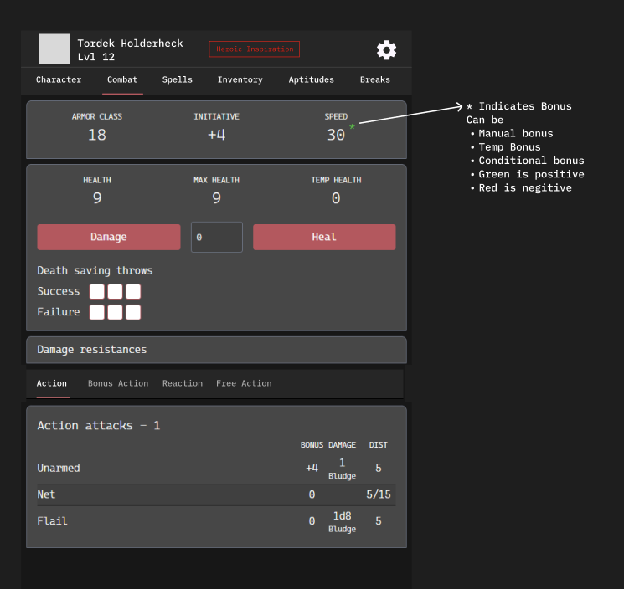
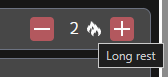

# Wireframe — Combat tab (default landing)

> **Entry gate:** the Phase D PR that builds/edits the Combat tab MUST link this
> file (plan L821). Default tab per plan L278 (at-the-table use, matches existing
> `Dnd5Combat` default).

## Mockup (image3)

Limited-use action control (image1) — the charge stepper used by actions, items,
and per-use features:

## Ordered hierarchy (plan L278-280)

Build order is the **plan** order, which intentionally reorders the mockup:
the mockup paints AC/init/speed first, but the plan puts **HP first** (steppers
are the most-touched control at the table; constraint-worship 3-first).

1. **HP block** — HEALTH / MAX HEALTH / TEMP HP, `Damage [numeric] Heal`
   steppers (≥44px). Heal-above-max allowed (digest §8, non-RAW). Tap a value →
   modal to edit max/temp (already in `Dnd5Combat`).
2. **AC + Initiative + Speed** — one 3-up block; `★` = active bonus
   (green positive / red negative; manual, temp, or conditional — image3 callout).
   Speed expands to walk/fly/swim/climb/burrow. Spell DC star when a spell type
   diverges from base (digest §2, non-standard).
3. **Aggregated Actions** — Action / Bonus Action / Reaction / Free Action
   sub-tabs (image3). Each aggregates from **spells, base rules, equipped items,
   class abilities, consumables, feats**, one collapsible source subsection each
   (digest §2). Columns: BONUS / DAMAGE / DIST; spells show DC, dice, type.
   Limited-use rows use the image1 `[−] n 🔥 [+]` stepper with recharge icon;
   consumables decrement inventory on use; free-cast-first defaulting with a
   use-slot override toggle.

Then: **Conditions / Damage resistances** (collapsible), **Death saving throws**
(3+3 boxes), **Concentration** (auto-on when a concentration spell is cast),
**Exhaustion** (dnd2024), **Status toggles**.

## Applicable state-matrix rows (plan L290-303)

- **Conditions (row 5):** mechanical conditions render as a filled toggle + stat
  delta; informational conditions render as an outline badge with **no math
  claim**. Empty = "no active".
- **Options lists (row 2):** the Actions aggregation is an options list — gated
  rows (e.g. abilities not yet unlocked) are **labeled, not hidden**; loading =
  skeleton rows; error = retry banner; empty = "content not seeded" + seed hint.
- **Warning banners (row 4):** stack newest-first, max 3 + "N more"; dismissible
  (`role="alert"`); dismissed collapse to a count chip. (Concentration-break and
  over-cast warnings surface here.)

Trait picker and Rest confirm rows do not apply to this tab.

## Component mapping

- HP / AC-init-speed blocks → `StatsBlock.jsx` (already used in `Dnd5/Combat.jsx`).
- Damage/Heal → `Button.jsx` + numeric `Input.jsx`; steppers → `IconButton.jsx`.
- Damage resistances collapse → `Toggle.jsx` + `Checkbox.jsx` grid (existing).
- Death saves → `Checkbox.jsx` rows (existing).
- Action sub-tabs → new local tab state; rows → `ItemsTable`-style rows.
- Limited-use stepper (image1) → `IconButton.jsx` `[−] n [+]` + recharge icon.
- **New:** source-grouped Actions aggregation (current tab is a flat attacks
  table), Concentration auto-toggle, Status-toggle list, warnings-summary stack.

## Motion

- Sub-tab switch (Action↔Bonus↔Reaction) — **Motion → TODOS L52**.
- Resistances collapse/expand — **Motion → TODOS L52**.
- HP delta feedback on Damage/Heal — **Motion → TODOS L52**.
- Edit-values modal open — **Motion → TODOS L52**.
