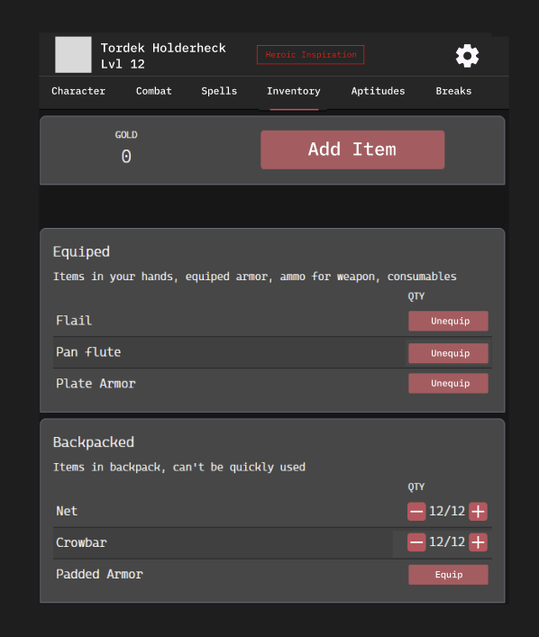

# Wireframe — Inventory tab

> **Entry gate:** the Phase D PR that builds/edits the Inventory tab MUST link
> this file (plan L821). (Doc calls this "Items"; component tree/routing use
> "Inventory" — digest contradiction 3; Inventory wins.)

## Mockup (image5)

## Ordered hierarchy (plan L283)

1. **Equipped** — items in hands / worn armor / ammo / consumables; these
   **affect stats**. Each row has `Equip`/`Unequip` toggle (image5) with
   immediate recalculation.
2. **Attunement (n/3)** — attuned items counted here (default limit 3, editable
   by abilities). At max, equipping another prompts "choose an item to unattune"
   (override allowed with warning). Equipped-but-not-attuned = inactive (gray).
3. **Backpack + Gold** — does not affect stats; consumables use `[−] n/n [+]`
   QTY steppers (image5: Net, Crowbar); at 0 qty move to the "Used" subsection.
   Single **Gold** number (silver 0.1, copper 0.01). **Add Item** button →
   mundane / search / Item Wizard.

Then: **Stored** (bank/cart/home, pushed to bottom), **Spell Components**.
Rarity colors: Common grey / Uncommon green / Rare blue / Legendary purple /
Unique gold; `*` if attunement required. Charged items show `3/7` + recharge rule.

## Applicable state-matrix rows (plan L290-303)

- **Options lists (row 2):** the Add-Item search / mundane list is an options
  list — loading = skeleton rows; error = retry banner; empty = "content not
  seeded" + seed hint; gated rows labeled, not hidden.
- **Warning banners (row 4):** attunement-limit exceed is a **soft warning**
  ("You have max attuned items…"), overridable; unequip-side-effect notices
  surface here. Stack newest-first, max 3 + "N more", `role="alert"`.

Trait picker / Rest confirm / Conditions do not apply.

## Component mapping

- Gold / header → `StatsBlock.jsx` + `Button.jsx` (Add Item).
- Category sections (Equipped/Attuned/Backpack/Stored) → `ItemsTable.jsx`.
- Item rows + Equip/Unequip + slot icons → `ItemsTableItem.jsx` (existing
  hands/equipment/backpack/storage states).
- QTY steppers → `IconButton.jsx` `[−] n [+]` + numeric `Input.jsx`.
- Item description / effects → **Info Modal** (`Modal.jsx`).
- Item Wizard / upgrades → `molecules/ItemUpgrades/` (existing).
- **New:** Attunement section with `n/3` counter + unattune prompt, rarity-color
  tokens, "Used" consumables bin, Spell Components section.

## Motion

- Section collapse/expand — **Motion → TODOS L52**.
- Equip/Unequip stat-recalc feedback — **Motion → TODOS L52**.
- Add-Item modal / Item Wizard open — **Motion → TODOS L52**.
