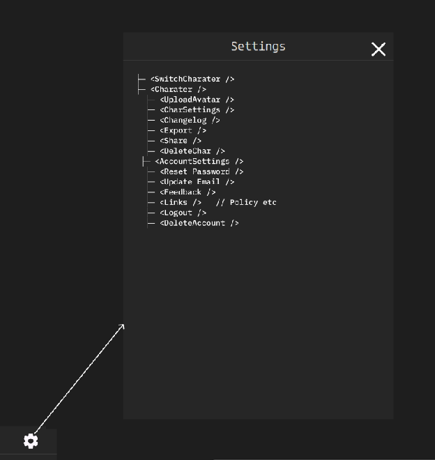

# Wireframe — Settings (modal)

> **Entry gate:** the Phase D PR that builds/edits Settings MUST link this file
> (plan L821). Settings is a gear-triggered modal (image8), not a tab, but is a
> required Phase D surface (it hosts the dismissed-warnings restore list, T11).

## Mockup (image8)

The doc renders Settings as its component tree (image8): gear (bottom/topbar) →
modal titled **Settings** with a close `X`.

## Ordered hierarchy (digest §2 Settings + component tree §6)

1. **Switch Character** — change to another character; entry to create-new.
2. **Character settings** — Upload Avatar, Char Settings (Show Avatar toggle,
   Reset All User Modifications/Overrides), **Changelog** (per-character batched
   change log; "Last Rest: Long, 08/04/25, +1 HD, 2 spells restored"), **Export**
   (Official-Style / App-Style sheet, section select, single-click PDF), **Share**
   (single active live link, copy/revoke, content filters), Delete Char
   (confirm by typing "delete me").
3. **Account settings** — Reset Password, Update Email, Feedback, Links (policy),
   Logout, Delete Account.

**TLC addition (T11, plan L311-312):** a **Dismissed-warnings restore list** —
every warning dismissed elsewhere is listed here with a per-item restore; restore
→ the warning reappears on its origin surface. Closes the one-way-door gap.

## Applicable state-matrix rows (plan L290-303)

- **Warning banners (row 4):** Settings is the **restore side** of the dismissal
  lifecycle — the dismissed-warnings list drives the "dismissed collapse to count
  chip" partial state back to a live banner.
- **Options lists (row 2):** Export section-selection (Core / Combat / Spells /
  Items / Aptitudes / Companion; Select All / Summary) and Share content filters
  are options lists — loading = skeleton; error = retry banner.

Trait picker / Rest confirm / Conditions do not apply.

## Component mapping

- Settings shell → `molecules/Modal.jsx` / `createModal()`.
- Rows / buttons → `atoms/Button.jsx`, `atoms/Toggle.jsx`, `atoms/Checkbox.jsx`.
- Avatar upload / fields → `EditWrapper.jsx` + `Input.jsx`.
- Delete-confirm ("delete me") → `Input.jsx` gated `Button.jsx`.
- **New:** Dismissed-warnings restore list (T11), Export PDF flow (deferred —
  TODOS "PDF export"), Share live-link controls (deferred — TODOS "Live share").
  PDF/Share are out of Phase D scope; the settings shell reserves their slots.

## Motion

- Settings modal open/close — **Motion → TODOS L52**.
- Warning restore → banner reappear on origin surface — **Motion → TODOS L52**.
