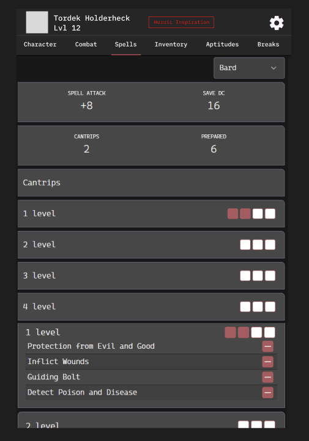

# Wireframe — Spells tab

> **Entry gate:** the Phase D PR that builds/edits the Spells tab MUST link this
> file (plan L821).

## Mockup (image4)

## Ordered hierarchy (plan L282-283)

1. **Spell slots** — per-level pip boxes touched to fill (image4: filled/used
   render red). Slots sit on each level's section header.
2. **Prepared list** — sections **by class** (class dropdown, e.g. Bard);
   grouped by spell level, each row with a `[−]` remove. "Always prepared" pinned
   at the bottom. Cantrips get their own top section. This tab manages
   preparing/learning — casting happens on Combat.
3. **Spell DC(s)** — SPELL ATTACK and SAVE DC block (image4: `+8 / 16`); star +
   per-type breakdown when a spell type diverges from base.

Then: prepared/known **counts** (CANTRIPS / PREPARED with allowed limits),
filters (level, school, components, concentration, ritual…), and the External
Sources / Ability-or-Item spell section.

## Applicable state-matrix rows (plan L290-303)

- **Options lists (row 2):** the add/learn/prepare spell lists are the canonical
  options lists — gated rows labeled `Ch.4` / `Reputation`, **not hidden**;
  loading = skeleton rows; error = retry banner; empty = "content not seeded" +
  seed hint.
- **Warning banners (row 4):** over-limit prep/known is a **soft warning**, never
  a block — "You have prepared 8 spells, but your limit is 5 (Cleric Level 3 +
  WIS 2)". Stack newest-first, max 3 + "N more", dismissible `role="alert"`.

Trait picker / Rest confirm / Conditions do not apply.

## Component mapping

- Spell-attack / Save-DC / counts → `StatsBlock.jsx`.
- Class selector → `atoms/Select.jsx`.
- Level sections → `atoms/Toggle.jsx` (collapsible) with pip boxes in the header.
- Spell rows + `[−]` remove → `ItemsTable`-style rows + `IconButton.jsx`.
- Spell description popup → **Info Modal** (`Modal.jsx` / `createModal()`).
- Existing `Dnd2024/Spells.jsx`, `SpellsToggleList.jsx`, `Dnd5/SpellsTable.jsx`
  are the starting point.
- **New:** spell-slot pip boxes (touch-to-fill), per-class allowed-count with
  soft-warning banner, External Sources section.

## Motion

- Level-section collapse/expand — **Motion → TODOS L52**.
- Slot pip fill/empty feedback — **Motion → TODOS L52**.
- Spell Info Modal open — **Motion → TODOS L52**.
